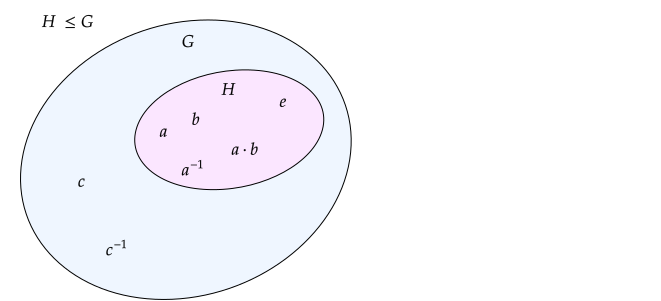

# Groups

Authors: Ariana, Zademn  
Reviewed by:

## Introduction

Modern cryptography is based on the assumption that some **problems** are hard \(unfeasable to solve\). Since the we do not have infinite computational power and storage we usually work with finite messages, keys and ciphertexts and we say they lay in some finite **sets** $$\mathcal{M}, \mathcal{K}$$ and $$\mathcal{C}$$.

Furthermore, to get a ciphertext we usually perform some **operations** with the message and the key.


For example in AES128 $$\mathcal{K} = \mathcal{M} = \mathcal{C} = \{0, 1\}^{128}$$since the input, output and key spaces are 128 bits. We also have the encryption and decryption operations:  
$$Enc: \mathcal{K} \times \mathcal{M} \to \mathcal{C} \\  Dec: \mathcal{K} \times \mathcal{C} \to \mathcal{M}$$


The study of **sets**, and different types of **operations** on them is the target of _abstract algebra_.   
In this chapter we will learn the underlying building blocks of cryptosystems and some of the hard problems that the cryptosystems are based on.

## Definition

A set$$G$$paired with a binary operation $$\cdot:G\times G\to G$$is a **group** if the following requirements hold:

* **Closure**: For all $$a, b \in G: \ $$ $$a\cdot b \in G$$ - Applying the operation keeps the element in the set
* **Associativity**: For all $$a, b, c \in G: $$ $$(a \cdot b) \cdot c=a\cdot (b\cdot c)$$
* **Identity**: There exists an element$$e\in G$$such that $$a\cdot e=e\cdot a=a$$for all $$a\in G$$
* **Inverse**: For all elements $$a\in G$$, there exists some $$b\in G$$such that $$b\cdot a=a\cdot b=e$$. We usually denote$$b$$as $$a^{-1}$$

For $$n\in\mathbb Z$$, $$a^n$$means $$\underbrace{a\cdot a\dots{}\cdot a}_{n\text{ times}}$$when $$n>0$$and $$\left(a^{-n}\right)^{-1}$$when $$n<0$$. For $$n=0$$, $$a^n=e$$.

If $$ab=ba$$, then $$\cdot$$is **commutative** and the group is called **abelian**. We often denote the group operation by $$+$$instead of $$\cdot$$and we typically use $$na$$instead of $$a^n$$.

**Remark**

* The identity element of a group $$G$$ is also denoted with $$1_G$$ or just $$1$$ if only one groups is present

**Examples of groups**

Integers modulo $$n$$ \(remainders\) under modular addition  $$= (\mathbb{Z} / n \mathbb{Z},  +)$$.   
$$\mathbb{Z} / n \mathbb{Z} = \{0, 1, ..., n -1\}$$  
Let's look if the group axioms are satisfied

1. $$\checkmark$$ $$\forall a, b \in \mathbb{Z}/ n\mathbb{Z} \text{ let }  c \equiv a + b \bmod n$$.  Because of the modulo reduction $$c < n \Rightarrow c \in \mathbb{Z}/ n\mathbb{Z} $$ 
2. $$\checkmark$$Modular addition is associative
3. $$\checkmark $$$$0 + a \equiv a + 0 \equiv a \bmod n \Rightarrow 0$$ is the identity element
4. $$\checkmark$$$$\forall a \in \mathbb{Z}/ n\mathbb{Z} $$we take $$n - a \bmod n$$to be the inverse of $$a$$. We check that

    $$a + n - a \equiv n \equiv 0 \bmod n$$

   $$n - a + a \equiv n \equiv 0 \bmod n$$

Therefore we can conclude that the integers mod $$n$$ with the modular addition form a group.

```python
Z5 = Zmod(5) # Technically it's a ring but we'll use the addition here
print(Z5.list())
# [0, 1, 2, 3, 4]

print(Z5.addition_table(names = 'elements'))
# +  0 1 2 3 4
#  +----------
# 0| 0 1 2 3 4
# 1| 1 2 3 4 0
# 2| 2 3 4 0 1
# 3| 3 4 0 1 2
# 4| 4 0 1 2 3

a, b = Z5(14), Z5(3)
print(a, b)
# 4 3
print(a + b)
# 2
print(a + 0)
# 4
print(a + (5 - a))
# 0

```

**Example of non-groups**

$$(\mathbb{Q}, \cdot)$$ is not a group because we can find the element $$0$$ that doesn't have an inverse for the identity $$1$$.  
$$(\mathbb{Z}, \cdot)$$is not a group because we can find elements that don't have an inverse for the identity $$1$$

**Exercise**

Is $$(\mathbb{Z} / n \mathbb{Z} \smallsetminus \{0\}, \cdot)$$a group? If yes why? If not, are there values for $$n$$that make it a group?

sɹosᴉʌᴉp uoɯɯoɔ puɐ sǝɯᴉɹd ʇnoqɐ ʞuᴉɥ┴ :ʇuᴉH

### Proprieties

1. The identity of a group is **unique**
2. The inverse of every element is **unique**
3. $$\forall$$ $$a \in G \ :  \left(a^{-1} \right) ^{-1} = g$$. The inverse of the inverse of the element is the element itself
4. $$\forall a, b \in G: $$ $$(ab)^{-1} = b^{-1}a^{-1}$$

   _Proof:_ $$(ab)(b^{−1}a^{−1}) =a(bb^{−1})a^{−1}=aa^{−1}= e.$$\_\_

```python
n = 11
Zn = Zmod(n)
a, b = Zn(5), Zn(7)
print(n - (a + b))
# 10
print((n - a) + (n - b))
# 10
```

## Orders

In abstract algebra we have two notions of order: Group order and element order

**Group order**

> The order of a group $$G$$is the **number of the elements** in that group. Notation: $$|G|$$

**Element order**

> The order of an element $$a \in G$$ is the **smallest integer** $$n$$ such that $$a^n = 1_G$$. If such a number $$n$$ doesn't exist we say the element has order $$\infty$$. Notation: $$|a|$$

```python
Z12 = Zmod(12) # Residues modulo 12
print(Z12.order()) # The additive order 
# 12
a, b= Z12(6), Z12(3)
print(a.order(), b.order())
# 2 4
print(a.order() * a)
# 0

print(ZZ.order()) # The integers under addition is a group of infinite order
# +Infinity
```


We said our messages lay in some group $$\mathcal{M}$$. The order of this group $$|\mathcal{M}|$$ is the number of possible messages that we can have. For $$\mathcal{M} = \{0,1\}^{128}$$we have $$|\mathcal{M}| = 2^{128}$$ possible messages.



Let $$m \in \mathcal{M}$$be some message. The order of $$m$$ means how many **different** messages we can generate by applying the group operation on $$m$$


## Subgroups

**Definition**

Let $$(G, \cdot)$$ be a group. We say $$H$$is a subgroup of $$G$$ if $$H$$ is a subset of $$G$$ and $$(H, \cdot)$$forms a group.  
Notation: $$H \leq G$$

**Proprieties**

1. The identity of $$G$$ is also in $$H: $$$$1_H = 1_G$$
2. The inverses of the elements in $$H$$are found in $$H$$



**How to check** $$H \leq G$$**? Let's look at a 2 step test**

1. Closed under operation: $$\forall a, b \in H \to ab \in H$$
2. Closed under inverses: $$\forall a \in H \to a^{-1} \in H$$

### Generators

Let $$G$$be a group,$$g \in G$$an element and $$|g| = n$$. Consider the following set:

$$
\{1, g, g^2, ..., g^{n-1}\} \overset{\text{denoted}}{=} \langle g\rangle.
$$

 This set paired the group operation form a subgroup of $$G$$generated by an element $$g$$. 


Why do we care about subgroups? We praise the fact that some problems are hard because the numbers we use are huge and exhaustive space searches are too hard in practice.

Suppose we have a big secret values space $$G$$and we use an element $$g$$to generate them.

If an element$$g \in G$$with a small order $$n$$ is used then it can generate only $$n$$ possible values and if $$n$$ is small enough an attacker can do a brute force attack.


**Example**

For now, trust us that if given a prime $$p$$, a value $$g \in \mathbb{Z} / p \mathbb{Z}$$ and we compute $$y = g^x \bmod p$$ for a secret $$x$$, finding $$x$$ is a hard problem. We will tell you why a bit later.

```python
p = 101 # prime
Zp = Zmod(p) 
H_list = Zp.multiplicative_subgroups() # Sage can get the subgroup generators for us
print(H_list)
# ((2,), (4,), (16,), (32,), (14,), (95,), (10,), (100,), ())

g1 = H_list[3][0] # Weak generator
print(g1, g1.multiplicative_order())
# 32 20

g2 = Zp(3) # Strong generator
print(g2, g2.multiplicative_order())
# 3 100


## Consider the following functions
def brute_force(g, p, secret_value):
    """
    Brute forces a secret value, returns number of attempts
    """
    for i in range(p-1):
        t = pow(g, i, p)
        if t == secret_value:
            break
    return i
    
def mean_attempts(g, p, num_keys):
    """
    Tries `num_keys` times to brute force and 
    returns the mean of the number of attempts
    """
    total_attempts = 0
    for _ in range(num_keys):
        k = random.randint(1, p-1)
        sv = pow(g, k, p) # sv = secret value
        total_attempts += brute_force(g, p, sv)
    return 1. * total_attempts / num_keys
    
## Let's try with our generators
print(mean_attempts(g1, p, 100)) # Weak generator
# 9.850
print(mean_attempts(g2, p, 100)) # Strong generator
# 49.200

```

## Examples

// subgroups, quotient groups

// cyclic groups

