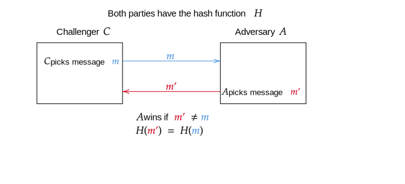
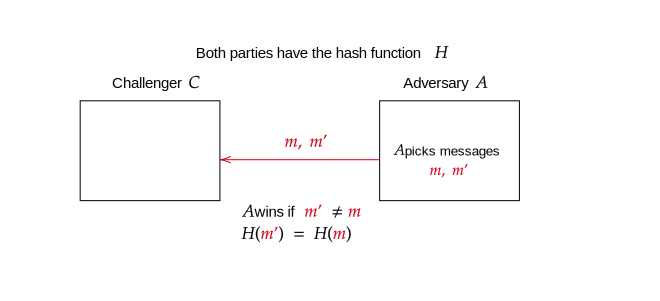

# Introduction / overview

Author: Zademn

Reviewed by: 

## Introduction

Another desired propriety of our cryptographic protocols is **data / message integrity**. This propriety assures that during a data transfer the data has not been modified.

Suppose Alice has a new favourite game and wants to send it to Bob. How can Bob be sure that the file he receives is the same as the one Alice intended to send? One would say to run the game and see. But what if the game is a malware? What if there are changes that are undetectable to the human eye?

 **Hashes** are efficient algorithms to check if two files are the same based on the data they contain. The slightest change \(a single bit\) would change the hash completely.


On the internet, when you download, files you often see a number near the download button called the **hash** of that file. If you download that file, recalculate the hash locally and obtain the same hash you can be sure that the data you downloaded is the intended one.



Another use for hashes is storing passwords. We don't want to store plaintext passwords because in case of a breach the attacker will know our password. If we hash them he will have to reverse the hash \(or find a collision\) to use our password. Luckily the hashes are very hard to reverse and collision resistant by definition and construction.



Note that hashes need a secure channel for communication. Alice must have a secure way to send her hash to Bob. If Eve intercepts Alice's message and hash she can impersonate Alice by changing the file, computing the hash and sending them to Bob. Hashes do not provide **authenticity.**


## Definitions and Formalism 

**Definition - Hash**

> A hash is an **efficient deterministic** function that takes an arbitrary length input and produces a fixed length output \(digest, hash\). Let $$H:\mathcal{M} \longrightarrow \mathcal{T}$$ be a function where
>
> * $$\mathcal{M}$$ = message space
> * $$\mathcal{T}$$ = digest space

**Desired proprieties**

* Deterministic
* Fast to compute
* Small changes change the hash completely
* Preimage, second preimage and collision resistance \(Explained below\)

_How to use a hash:_

* Suppose you want to check if Alice and Bob have the same version of some file \(**File integrity**\)
  * They compute $$H(a), H(b)$$
  * They check if $$H(a) = H(b)$$ 


```python
from hashlib import sha256
m1 = b"Some file"
m2 = b"Some file"
sha256(m1).digest() == sha256(m2).digest() # -> True
```

## Proprieties

* Preimage Image Resistance
* Second Preimage resistance
* Resistant to collisions

### 1. Preimage Resistance

> The hash function must be a one way function. Given $$t \in \mathcal{T}$$ find $$m \in \mathcal{M}$$ s.t $$H(m) = t$$


_Intuition_ 

It should be unfeasible to reverse a hash function \($$\mathcal{O}(2^l)$$ time where $$l$$ is the number of output bits\)

This propriety prevents an attacker to find the original message from a hash


### 2. Second Preimage Resistance

> Given $$m$$ it should be hard to find $$m' \neq m$$ with $$H(m') = H(m)$$

**Attack game**

> An adversary $$\mathcal{A}$$ is given a message $$m$$ and outputs a message $$m' \neq m$$.
>
> $$\mathcal{A}$$ wins the game if he finds $$H(m) = H(m')$$ 
>
> His advantage is $$Pr[\mathcal{A} \text{ finds a second preimage}]$$ where $$Pr(\cdot)$$is a probability



* In practice a hash function with $$l$$ bits output should need $$2^l$$ queries before one can find a second preimage
* This propriety prevents an attacker to substitute a message with another and get the same hash 

### 3. Hash Collisions


_Intuition_

A hash collision happens when we have two different messages that have the same hash


**Why do we care about hash collisions?**

* Since hashes are used to fastly verify a message integrity if two messages have the same hash then we can replace one with another =&gt; We can play with data
* Now, we want to hash big files and big messages so $$|\mathcal{M}| >> |\mathcal{T}|$$ =&gt; It would appear that hash collisions are possible
* Natural collisions are normal to happen and we consider them improbable if $$\mathcal{T}$$ is big enough \($$\text{SHA256} \Rightarrow T =$$ $$\{0,1\}^{256}$$\)
* Yet, we don't want hash collisions to be computable
  * We don't want an attacker to be able to craft collisions or find collisions given a message

#### Let's throw some definitions

**Attack game**

> An adversary $$\mathcal{A}$$ outputs two messages $$m_0 \neq m_1$$ 
>
> $$\mathcal{A}$$ wins the game if he finds $$H(m_0) = H(m_1)$$ 
>
> His advantage is $$Pr[\text{Adversary finds a collision}]$$



**Security**

> A hash function $$H$$ is collision resistant if for all efficient and **explicit** adversaries the advantage is negligible


Intuition

We know hash collisions exist \(therefore an efficient adversary must exist\) and that is easy to prove therefore we request an **explicit** algorithm that finds these collisions



This propriety makes it difficult for an attacker to find 2 input values with the same hash 


#### Difference from 2nd preimage

* There is a fundamental difference in how hard it is to break collision resistance and second-preimage resistance. 
  * Breaking collision-resistance is like inviting more people into the room until the room **contains 2 people with the same birthday**.   
  * Breaking second-preimage resistance is like inviting more people into the room until the room **contains another person with your birthday**.  
* One of these fundamentally takes longer than the other

**Implications**

**Lemma 1**

> Assuming a function $$H$$ is preimage resistant for every element of the range of $$H$$ is a **weaker** assumption than assuming it is either collision resistant or second preimage resistant.

**Note**

* Provisional implication
* [https://crypto.stackexchange.com/questions/10602/why-does-second-pre-image-resistance-imply-pre-image-resistance?rq=1](https://crypto.stackexchange.com/questions/10602/why-does-second-pre-image-resistance-imply-pre-image-resistance?rq=1)
* [https://crypto.stackexchange.com/questions/9684/pre-image-resistant-but-not-2nd-pre-image-resistant](https://crypto.stackexchange.com/questions/9684/pre-image-resistant-but-not-2nd-pre-image-resistant)

**Lemma 2**

> Assuming a function is second preimage resistant is a **weaker** assumption than assuming it is collision resistant.


## Resources

* [https://en.wikipedia.org/wiki/Cryptographic\_hash\_function](https://en.wikipedia.org/wiki/Cryptographic_hash_function) - Wikipedia entry
* [https://www.youtube.com/watch?v=b4b8ktEV4Bg](https://www.youtube.com/watch?v=b4b8ktEV4Bg) - Computerphile
* [https://www.tutorialspoint.com/cryptography/cryptography\_hash\_functions.htm](https://www.tutorialspoint.com/cryptography/cryptography_hash_functions.htm)
* [https://www.cs.ucdavis.edu/~rogaway/papers/relates.pdf](https://www.cs.ucdavis.edu/~rogaway/papers/relates.pdf) - Good read for more details

#### Bibliography

* Figure 1 - Wikipedia

