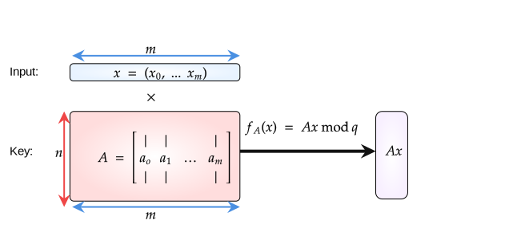

# Short integer solutions \(SIS\)

## Introduction

In this section we will study the short integer solution problem and a hashing algorithm that is based on this algorithm.

## Short integer solution problem

**Definition**

Let $$SIS_{n, m, q, \beta}$$ be a Short Integer Solution problem. We define it as such:

Given $$m$$ uniformly random vectors $$a_i∈\mathbb{Z}^n_q$$, forming the columns of a matrix $$A∈\mathbb{Z}^{n×m}_q$$, find a nonzero integer vector $$z∈\mathbb{Z}^m$$ of norm $$‖z‖ ≤β$$ \(short\) such that 

$$
f_A(z) = Az = \sum_i a_i \cdot z_i = 0 \in \mathbb{Z}^n_q \\ z_1\vec{a_1} + z_2\vec{a_2} +...+ z_m\vec{a_m} = 0
$$

Without the constraint $$\beta$$ the solution would be as simple as Gaussian elimination. Also we want $$\beta < q$$ otherwise $$z = (q,0, ..., 0) \in \mathbb{Z}^m$$ would be a fine solution.

Notice that a solution $$z$$ for $$A$$ can be converted to a solution for the extension $$[A| A']$$ by appending $$0$$s to $$z$$ $$\Rightarrow$$

* big $$m \Rightarrow$$  easy \(the more vectors we are given, the easier the problem becomes\)
* big $$n \Rightarrow$$  hard \(the more dimension we work in the harder the problem becomes\)

Solution existence is based on parameters set. One should think about them as follows:

* $$n$$ is the security parameter. The bigger it is the harder the problem becomes
* $$m$$ is set depending from application to application. Usually $$m \gg n$$
* $$q = \text{poly}(n)$$, think of it as $$q = \mathcal{O}(n^2)$$
* $$\beta = $$the bound is set depending on application and $$\beta \ll q$$

### SIS as a SVP problem

// TODO

## Ajtai's hashing function

* Parameters: $$m, n, q \in \mathbb{Z}$$, $$m > n \log_2 q$$
* Key: $$A \in \mathbb{Z}_q^{n \times m}$$
* Input: $$x \in \{0, 1\}^m \Rightarrow$$ Short vector
* Output: $$\boxed {f_A(x) = Ax \bmod q}$$ where $$f_A : \{0, 1\}^m \to \mathbb{Z}^n_q$$



### Hash function properties:

**Compression**

We know $$x \in \{0, 1\}^m \Rightarrow |\mathcal{X}| = 2^n$$ and $$Ax \in \mathcal Y = \mathbb{Z_q^n} \Rightarrow |\mathbb{Z_q^n}| = q^n = (2^{\log q})^n$$. Since we chose $$m > n \log q \Rightarrow |\mathcal{X}| > |\mathcal{Y}| $$.

**Collision resistance:**


halp here


**Sage example**:

```python
from Crypto.Util.number import long_to_bytes, bytes_to_long

n, m, q = 20, 40, 1009
set_random_seed(1337)
A = random_matrix(Zmod(q),n, m)

print(A.parent())
# Full MatrixSpace of 20 by 40 dense matrices over Ring of integers modulo 1009
print(A.lift().parent())
# Full MatrixSpace of 20 by 40 dense matrices over Integer Ring

msg = b'msg'
x = vector(Zmod(q), [int(i) for i in bin(bytes_to_long(msg))[2:].zfill(m)]) # pad message
print(len(x)
# 40

print(x.parent())
# Vector space of dimension 40 over Ring of integers modulo 1009

print(len(A * x))
# 20
```

### Cryptanalysis

Inverting the function:

> Given $$A$$ and $$y$$ find $$x \in \{0, 1\}^m$$ such that $$Ax = y \bmod q$$

Formulating as a lattice problem:

Find arbitrary $$t$$ such that $$At = y \bmod q$$

* All solutions to $$Ax = y$$ are of the form $$t + L^{\perp}$$ where $${L}^\perp(A) =  \{x \in \mathbb{Z}^m : Ax = 0 \in \mathbb{Z}^n_q \}$$
* So we need to find a short vector in $$t + {L}^{\perp}(A)$$
* Equivalent, find $$v \in {L}^{\perp}(A)$$ closest to $$t$$ \(CVP\)


### Hermite normal form

// TODO

## Security Reduction


If somebody can explain the security bounds and reduction better, please do.


## Resources

* [https://simons.berkeley.edu/sites/default/files/docs/14967/sis.pdf](https://simons.berkeley.edu/sites/default/files/docs/14967/sis.pdf) + [https://www.youtube.com/watch?v=qZIjVX61NFc&list=PLgKuh-lKre10rqiTYqJi6P4UlBRMQtPn0&index=4](https://www.youtube.com/watch?v=qZIjVX61NFc&list=PLgKuh-lKre10rqiTYqJi6P4UlBRMQtPn0&index=4)
* [https://crypto.stanford.edu/cs355/18sp/lec9.pdf](https://crypto.stanford.edu/cs355/18sp/lec9.pdf)
* [https://eprint.iacr.org/2015/939.pdf](https://eprint.iacr.org/2015/939.pdf) - page 18

