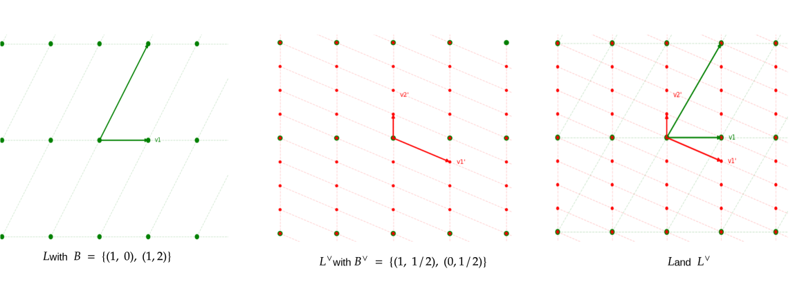
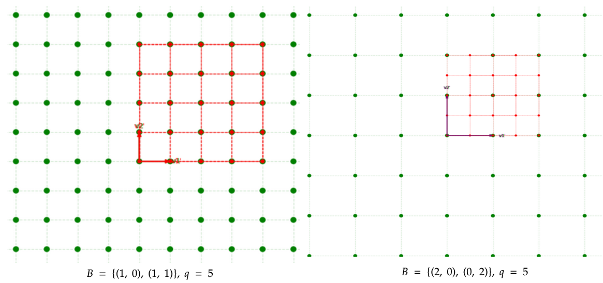
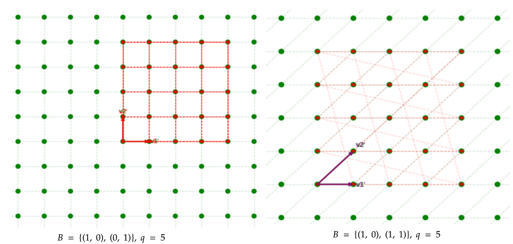

# Lattices of interest


Needs review.


## Introduction

In this chapter we will study some specific types of lattices that appear in cryptography. These will help us understand how certain problems we base  our algorithms on reduce to other hard problems.

Intuitively, if we have a problem \(1\) in some lattice space we can reduce it to a hard problem \(2\) in another related lattice space. Then if we can prove that if solving problem \(1\) implies solving problem \(2\) then we can conclude that problem \(1\) is as hard as problem \(2\)

Understanding this chapter will strengthen the intuition of what breaking a problem means and how to link it to another hard lattice problem.

## Dual lattice

Let $$L \subset \mathbb R^n$$be a lattice.  We define the dual of a lattice lattice as the set of all vectors $$y \in span(L)$$ such that $$y \cdot x \in \mathbb Z \ $$for all vectors $$x \in L$$:

$$
L^\vee = \{y \in span(L) : y \cdot x \in \mathbb{Z} \ \forall \ x \in L\}
$$


Note that the vectors in the dual lattice $$L^\vee$$ are not necessarily in the initial lattice $$L$$. They are **spanned** by the basis vectors of the lattice $$L$$.


**Examples**:

1. $$(\mathbb Z^n) ^ \vee = \mathbb Z^n$$ because the dot product of all vectors in $$\mathbb Z^n$$stays in $$\mathbb Z^n$$
2. Scaling: $$(k \cdot L)^\vee = \dfrac 1 k \cdot L$$  _Proof:_ If $$y \in (kL)^\vee \Rightarrow y \cdot kx = k(x \cdot y)  \in \mathbb{Z} \ \forall \ x \in L \Rightarrow y \in \dfrac 1 k L^\vee$$ If $$y \in \left (\dfrac 1 kL\right )^\vee \Rightarrow yv \in L^\vee \Rightarrow ky\cdot x = k(x \cdot y) = y \cdot kx \in \mathbb{Z}  \  \forall  \ x \ \in L \Rightarrow y \in (kL)^\vee$$

Plot: $$2\mathbb Z ^2$$ - green, $$\dfrac 1 2 \mathbb Z ^ 2$$ - red


_Intuition:_ We can think of the dual lattice $$L^\vee$$ as some kind of **inverse** of the initial lattice $$L$$

### Basis of the dual lattice

We will now focus on the problem of finding the basis $$B^\vee$$ of the dual lattice $$L^\vee$$given the lattice $$L$$ and its basis $$B$$.


**Reminder**: We can think of the lattice $$L$$ as a transformation given by its basis $$B \in GL_n(\mathbb R)$$on $$\mathbb Z^n$$. 


We have the following equivalences:

$$
\begin{align*} 
y \in L^\vee & \iff y \cdot x \in \mathbb Z \ \forall\ x \in L \\ & \iff B^Ty \in \mathbb{Z}^n \\ 
& \iff y \in (B^{-1})^T \cdot \mathbb Z^n
 \end{align*}
$$

Therefore $$L^\vee = (B^{-1})^T \cdot \mathbb Z^n$$so we have found a base for our dual lattice:

$$
B^\vee = (B^{-1})^T \in GL_n(\mathbb{R})
$$

```python
n = 5 # lattice dimension

B = sage.crypto.gen_lattice(m=n, q=11, seed=42)
B_dual = sage.crypto.gen_lattice(m=n,  q=11, seed=42, dual=True)

B_dual_ = (B.inverse().T * 11).change_ring(ZZ) # Scale up to integers
B_dual_.hermite_form() == B_dual.hermite_form() # Reduce form to compare
# True
```

* [https://en.wikipedia.org/wiki/Hermite\_normal\_form](https://en.wikipedia.org/wiki/Hermite_normal_form)

Let's look at some plots. With green I will denote the original lattice and with red the dual. The scripts for the plots can be found in in the interactive fun section



### Properties

1. $${L}_1 \subseteq {L}_2 \iff {L}^\vee_2 \subseteq {L}^\vee_1$$
2. $$({L}^\vee)^\vee ={L} = $$The dual of the dual is the initial lattice \(to prove think of the basis of $$L^\vee$$\)
3. $$\det(L^\vee) = \det(L) ^{-1}$$ \(to prove think of the basis of $$L^\vee$$\)
4. For $$x \in {L},   y \in {L}^\vee$$consider the vector dot product and addition - $$x \cdot y \in \mathbb{Z}$$ - $$x + y$$ has no geometric meaning, they are in different spaces

### Successive minima

We've seen that we can find the basis of the dual lattice given the basis of the original lattice. Let's look at another interesting quantity: the **successive minima** of a lattice $$L$$ and its dual $$L^\vee$$. Let's see what can we uncover about them.


We recommend to try and think about the problem for a few minutes before reading the conclusions. 

What is $$\lambda_1(2\mathbb Z^2)$$? What about $$\lambda_1((2\mathbb Z^2)^\vee)$$? Can you see some patterns?



**Reminder**: We defined the successive minima of a lattice $$L$$as such: 

$$
\lambda_i(L)=\min\left(\max_{1\leq j\leq i}\left(\left\lVert v_j\right\rVert\right):v_j\in L\text{ are linearly independent}\right)
$$


**Claim 1**:

$$
\lambda_1(L) \cdot \lambda_1(L^\vee) \leq n
$$

_Proof:_   
By Minkowski's bound we know:

 $$\lambda_1(L) \leq \sqrt{n} \cdot \det(L)^{1 / n}$$ and $$\lambda_1(L^\vee) \leq \sqrt{n} \cdot det(L^\vee)^{1 / n} = \dfrac {\sqrt{n}} {\det(L)^{1/n}}$$. By multiplying them we get the desired result.

From this result we can deduce that the minima of the $$L$$ and $$L^\vee$$have an inverse proportional relationship \(If one is big, the other is small\).

```python
n = 5 # lattice dimension

B = sage.crypto.gen_lattice(m=n, q=11, seed=42)
B_dual = sage.crypto.gen_lattice(m = n,  q=11, seed=42, dual=True)

l1 = IntegerLattice(B).shortest_vector().norm().n() 
l2 = IntegerLattice(B_dual).shortest_vector().norm().n() / 11

print(l1 * l2 < n)
# True
```

**Claim 2**:

$$
\lambda_1(L) \cdot \lambda_n(L^\vee) \geq 1
$$

_Proof:_

Let __$$x∈L$$ be such that $$\|x\|=λ_1(L)$$. Then take any set $$(y_1, . . . , y_n)$$ of $$n$$ linearly independent vectors in $$L^\vee$$.   
Not all of them are orthogonal to $$x$$. Hence, there exists an $$i$$ such that $$y_i \cdot x \neq 0$$ .   
By the definition of the dual lattice, we have $$y_i \cdot x \in \mathbb Z$$ and hence $$1 \leq y_i \cdot x \leq \|y_i\| \cdot \|x\| \leq \lambda_1 \cdot \lambda_n^\vee$$

```python
n = 5 # lattice dimension

B = sage.crypto.gen_lattice(m=n, q=11, seed=42)
B_dual = sage.crypto.gen_lattice(m = n,  q=11, seed=42, dual=True)

l1 = IntegerLattice(B).shortest_vector().norm().n() 

B_dual_lll = B_dual.LLL()
lnd = 0
for v in B_dual_lll:
    lv = v.norm()
    if lv > lnd:
        lnd = lv
lnd = lnd.n() / 11

print(lnd * l1 > 1) 
# True
```

## Geometry + Partitioning

// TODO


## Q-ary lattices

We've seen that in cryptography we don't like to work with infinite sets \(like $$\mathbb Z$$\) and we limit them to some finite set using the $$\bmod$$ operation \($$\mathbb Z \to \mathbb Z/ q\mathbb{Z}$$\). We will apply the same principle to the lattices so let us define the concept of a q-ary lattice.

**Notation**: I will denote $$\mathbb{Z}/q\mathbb Z$$ with $$\mathbb{Z}_q$$

**Definition:**

For a number $$q \in \mathbb{Z},\  q \geq 3$$we call a lattice **q-ary** if

$$
q\mathbb{Z}^n \subseteq {L} \subseteq \mathbb{Z}^n
$$

_Intuition:_

* $$q\mathbb{Z^n} \subseteq \mathcal{L}$$ is periodic $$\bmod \ q$$
* We use arithmetic $$\bmod \ q$$





We will now look at 2 more types of lattices that are q-ary. Let $$A \in \mathbb{Z}_q^{n \times m}$$ be a matrix with $$m > n$$. Consider the following lattices:  
$$L_q(A) = \{y : y = A^Tx \bmod q \in \text{ for some } x \in  \mathbb{Z}^n \} \subset \mathbb{Z^m}$$  
$$L^\perp_q(A) = \{y : Ay = 0 \bmod q \} \subset \mathbb{Z^m}$$

_Intuition:_

* Think of $$L_q(A)$$ as the image of the matrix $$A$$, the matrix spanned by the rows of $$A$$
* Think of $$L_q^\perp(A)$$ as the kernel of $$A$$ modulo $$q$$. The set of solutions $$Ax = 0$$


**Remark**: If the same matrix $$A$$ is used \($$A$$ is fixed \) then $$L_q(A) \neq L_q^\perp(A)$$


**Claim**:

$$L_q(A)$$ and $$L_q^\perp(A)$$ are the dual of each other \(up to scaling\): $$L_q(A) = \dfrac 1 q L_q^\perp(A)$$

_Proof:_

Firstly we will show $$L_q^\perp(A) \subseteq q(L_q(A))^\vee$$

* Let  $$y \in L_q^\perp(A) \Rightarrow Ay \equiv 0 \bmod q \iff Ay = qz$$for some $$z \in \mathbb{Z}^m$$
* Let $$y' \in L_q(A)\Rightarrow y' \equiv A^Tx \bmod q \iff y' =  A^Tx + qz'$$ for some $$x \in \mathbb Z^n, \ z' \in \mathbb Z^m$$

Then we have:$$y \cdot y' = y \cdot (A^Tx + qz') = y\cdot A^Tx + q (y \cdot z') = \underbrace{Ay}_{qz} \cdot x + q(y \cdot z') = qz \cdot x + q(y \cdot z')$$

$$\Rightarrow \dfrac 1 q y \cdot y' \in \mathbb{Z} \Rightarrow \dfrac 1 q y\in L_q(A)^\vee$$

The second part is left as an exercise to the reader :D. Show $$L_q^\perp(A) \supseteq q(L_q(A))^\vee$$

## Resources

* [https://cims.nyu.edu/~regev/teaching/lattices\_fall\_2004/ln/DualLattice.pdf](https://cims.nyu.edu/~regev/teaching/lattices_fall_2004/ln/DualLattice.pdf)
* [https://sp2.uni.lu/wp-content/uploads/sites/66/2019/06/DualLattice-Luca-Notarnicola.pdf](https://sp2.uni.lu/wp-content/uploads/sites/66/2019/06/DualLattice-Luca-Notarnicola.pdf)
* [https://simons.berkeley.edu/sites/default/files/docs/14953/intro.pdf](https://simons.berkeley.edu/sites/default/files/docs/14953/intro.pdf)
* [https://cseweb.ucsd.edu/~daniele/papers/FOSAD11.pdf](https://cseweb.ucsd.edu/~daniele/papers/FOSAD11.pdf)

