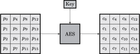

# AES

## Introduction

The Advanced Encryption Standard most known as AES is one of the most used ciphers nowadays.  
Created by Vinent Rijmen and Joan Daemen under the name _Rijndael,_ it won the NIST competition that resulted in its standardization in 2001 to replace older algorithms such as DES \(and its variant 3DES\). In fact, it is six times faster than 3DES.

AES encrypts a block of 16 bytes only at a time, though ciphertexts tend to be much longer. To accomodate this, cipherexts are cut in blocks of 16 bytes using an operating mode \[see future section on mode\]. We only focus on the encryption of a single block.

The array of 16 bytes$$(p_0,\ldots,p_{15})$$are arranged from up to bottom, column by column in$$4 \times 4$$matrix. During the encryption, the state of this matrix changes and results in a 16-bytes ciphertext$$(c_0,\ldots,c_{15})$$whose output can be read following the same ordering:

A key is involved and three sizes are possible: 128, 192, or 256 bits. Depending of the size, there are a few differences which will be explained later. For now, it is sufficient to know that round keys are derived from this master key.

Our interest is to look at what goes inside the transformation between the plaintext and the ciphertext. Basically, there are **four** operations on the state matrix, each important for the security of AES:

* `AK`: add round key;
* `SR`: shift row;
* `SB`: substitution box;
* `MC`: MixColumn.

All these operations are executed a several number of times in what are called _rounds_ to mix the plaintext enough. A look on the flow of an encryption is given in the figure below.

Two particular cases can be noticed:

* the first round is preceded by an additional `AK`;
* last round is missing `MC`.

The number of rounds `NR` is different depending on the master key length:

| Key length | Number of rounds |
| :--- | :--- |
| 128 | 10 |
| 192 | 12 |
| 256 | 14 |

