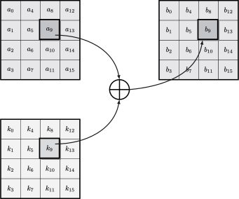
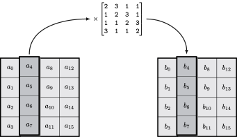

# Round Transformations

This page gives a description of the four operations that compose a round of AES.  
Each has been designed to satisfy criterias, one of them is that all must be invertible.

## Add Round Key


This is the only operation that involves a key. It is obvious that omitting it would mean no encryption.


Round keys are derived from the master key \(see the _Key Schedule_ section\) and are all composed of 16 bytes.  
We simply `xor` byte by byte the state by the bytes of the round key in the according position.



Its inverse is itself: if we xor again, we get back the original value of the state.

## Mix Columns


A major goal of `MC` is the **diffusion** property: each byte has an impact on the whole column, so a modification propagates to other positions.


This operation mixes each column of the state independently from each other: each byte of the column is replaced by a \(slightly different\) combination of the four bytes of the column.

Let $$(a_0, a_1, a_2, a_3)$$ the quadruplet of elements of a column, the operation `MC` is done by multiplying with a matrix $$M$$.



The calculations are performed in the finite field. If you are not familiar enough with the notions, you can skip to the next part and retain that this operation is also invertible using another matrix.

This matrix is circulant: each row is the same as the one above but is shifted by one column. So we can construct it in one line of SageMath \(recall that the bytes `02` and `03` correspond respectively to $$x$$and $$x+1$$ in the field\):

```python
# we construct the matrix
# (we use the finite field F constructed in the previous page)
M = Matrix.circulant([x, x + 1, 1, 1])
M
# [    x x + 1     1     1]
# [    1     x x + 1     1]
# [    1     1     x x + 1]
# [x + 1     1     1     x]

# We multiply a column
col1 = vector([F.random_element() for i in range(4)])
col1
# (x^6 + x + 1, x^7 + x^4 + x^2, x^6 + x^4 + x^3 + x^2, x^7 + x^6 + x^4 + x^3 + x^2)
col2 = M*col1
col2
# (x^7 + x^5 + 1, x^6 + x^3, x^4, x^7 + x^5 + x^3 + x^2 + x)
```

### Inverse of Mix Column

It is needed to reverse `MC` for the decryption process. Fortunately, there exists a matrix $$N$$ such that $$M\times N = N \times M = \textrm{Id}$$, the identity matrix.

```python
N = M^-1
N
# [x^3 + x^2 + x   x^3 + x + 1 x^3 + x^2 + 1       x^3 + 1]
# [      x^3 + 1 x^3 + x^2 + x   x^3 + x + 1 x^3 + x^2 + 1]
# [x^3 + x^2 + 1       x^3 + 1 x^3 + x^2 + x   x^3 + x + 1]
# [  x^3 + x + 1 x^3 + x^2 + 1       x^3 + 1 x^3 + x^2 + x]

# hexadecimal representation
for row in N:
    print([F_to_hex(a) for a in row])
# ['e', 'b', 'd', '9']
# ['9', 'e', 'b', 'd']
# ['d', '9', 'e', 'b']
# ['b', 'd', '9', 'e']

col3 = N*col2
col3 == col1
# True
```


We remark that the coefficient of the matrix are less friendly for the inverse operation as it involves polynomial of higher degree.  
This means that the decryption is a bit slower.


## Shift Rows


The goal of shifting rows is reinforce the **diffusion** property: the bytes of a column are shifted so they are all positioned on different columns.  
Combined with `MC`, then a one byte modification will have an effect to the whole state after several rounds: this is the [Avalanche effect](https://en.wikipedia.org/wiki/Avalanche_effect).


This operation shifts the rows of the state in the following manner:


The rows are shifted from top to bottom respectively by an offset of 0, 1, 2 or 3 columns to the left. Bytes that overflow on the left are put back to the right of the row.

The inverse is almost the same: the rows are shifted to the right instead by the same offsets and exceeding bytes are put back to the left.


**Small exercise**: to what extent would be the impact on the security of AES if no shifting were present?


## Substitution Box


Last, but not least, the `SB` design criterias is to bring the **confusion** property to make correlation between a plaintext and a ciphertext as small as possible.


The precedent operations shuffle the plaintext in such a way that any modification of a byte has an impact to the whole state after several rounds. Though, this is not enough as those operations are _linear:_ it means that the ciphertext could be expressed as linear equations from the plaintext and the master key. From a known couple plaintext/ciphertext it would be easy to solve the system and find the key.

The substitution box is the operation that breaks the linearity: each byte of the state is replaced by another following the table below.

|  | 00 | 01 | 02 | 03 | 04 | 05 | 06 | 07 | 08 | 09 | 0a | 0b | 0c | 0d | 0e | 0f |
| :--- | :--- | :--- | :--- | :--- | :--- | :--- | :--- | :--- | :--- | :--- | :--- | :--- | :--- | :--- | :--- | :--- |
| 00       | 63 | 7c | 77 | 7b | f2 | 6b | 6f | c5 | 30 | 01 | 67 | 2b | fe | d7 | ab | 76 |
| 10 | ca | 82 | c9 | 7d | fa | 59 | 47 | f0 | ad | d4 | a2 | af | 9c | a4 | 72 | c0 |
| 20 | b7 | fd | 93 | 26 | 36 | 3f | f7 | cc | 34 | a5 | e5 | f1 | 71 | d8 | 31 | 15 |
| 30 | 04 | c7 | 23 | c3 | 18 | 96 | 05 | 9a | 07 | 12 | 80 | e2 | eb | 27 | b2 | 75 |
| 40 | 09 | 83 | 2c | 1a | 1b | 6e | 5a | a0 | 52 | 3b | d6 | b3 | 29 | e3 | 2f | 84 |
| 50 | 53 | d1 | 00 | ed | 20 | fc | b1 | 5b | 6a | cb | be | 39 | 4a | 4c | 58 | cf |
| 60 | d0 | ef | aa | fb | 43 | 4d | 33 | 85 | 45 | f9 | 02 | 7f | 50 | 3c | 9f | a8 |
| 70 | 51 | a3 | 40 | 8f | 92 | 9d | 38 | f5 | bc | b6 | da | 21 | 10 | ff | f3 | d2 |
| 80 | cd | 0c | 13 | ec | 5f | 97 | 44 | 17 | c4 | a7 | 7e | 3d | 64 | 5d | 19 | 73 |
| 90 | 60 | 81 | 4f | dc | 22 | 2a | 90 | 88 | 46 | ee | b8 | 14 | de | 5e | 0b | db |
| a0 | e0 | 32 | 3a | 0a | 49 | 06 | 24 | 5c | c2 | d3 | ac | 62 | 91 | 95 | e4 | 79 |
| b0 | e7 | c8 | 37 | 6d | 8d | d5 | 4e | a9 | 6c | 56 | f4 | ea | 65 | 7a | ae | 08 |
| c0 | ba | 78 | 25 | 2e | 1c | a6 | b4 | c6 | e8 | dd | 74 | 1f | 4b | bd | 8b | 8a |
| d0 | 70 | 3e | b5 | 66 | 48 | 03 | f6 | 0e | 61 | 35 | 57 | b9 | 86 | c1 | 1d | 9e |
| e0 | e1 | f8 | 98 | 11 | 69 | d9 | 8e | 94 | 9b | 1e | 87 | e9 | ce | 55 | 28 | df |
| f0 | 8c | a1 | 89 | 0d | bf | e6 | 42 | 68 | 41 | 99 | 2d | 0f | b0 | 54 | bb | 16 |


If `3b` is the input, its output is on row `30` and column `0b` and is the byte `e2`.


Let `sbox` the name of this table, then for any bytes `b1` and `b2`, we have

$$
\texttt{sbox}(\texttt{b1} \oplus \texttt{b2}) \neq \texttt{sbox}(\texttt{b1}) \oplus \texttt{sbox}(\texttt{b2})
$$

which is the desired property.  


Though, this is not enough and the design of the `sbox` is made to include a sufficient algebraic complexity.  
The construction of the `sbox` table is done in two steps:

1. An element$$a$$is replaced by $$b = a^{-1}$$ \($$0$$ has no inverse and is mapped to $$0$$\);
2. An affine transformation on the coefficients of $$a$$:

$$
\begin{bmatrix}
1 & 0 & 0 & 0 & 1 & 1 & 1 & 1 \\
1 & 1 & 0 & 0 & 0 & 1 & 1 & 1 \\
1 & 1 & 1 & 0 & 0 & 0 & 1 & 1 \\
1 & 1 & 1 & 1 & 0 & 0 & 0 & 1 \\
1 & 1 & 1 & 1 & 1 & 0 & 0 & 0 \\
0 & 1 & 1 & 1 & 1 & 1 & 0 & 0 \\
0 & 0 & 1 & 1 & 1 & 1 & 1 & 0 \\
0 & 0 & 0 & 1 & 1 & 1 & 1 & 1
\end{bmatrix}
\cdot
\begin{bmatrix}
b_0 \\ b_1 \\ b_2 \\ b_3 \\ b_4 \\ b_5 \\ b_6 \\ b_7
\end{bmatrix}
+
\begin{bmatrix}
1 \\ 1 \\ 0 \\ 0 \\ 0 \\ 1 \\ 1 \\ 0
\end{bmatrix}
$$

The table we gave above has been construted with SageMath and applying the two steps:

```python
def construct_sbox():
    mat = Matrix.circulant(vector(GF(2), [1,0,0,0,1,1,1,1]))
    sbox = []
    for a in range(256):
        # convert a byte value to field element
        b = sum(((a >> i) & 1)*x^i for i in range(8))
        # first step: map to inverse
        if b != 0:
        b = b^-1
        # second step:
        # affine transformation using a vector space over GF(2)
        b = mat*vector(b) + vector(GF(2), [1, 1, 0, 0, 0, 1, 1, 0])
        # convert the vector as an integer in [0, 255]
        sbox.append(sum(ZZ(b[i]) << i for i in range(8)))
    return sbox

sbox = construct_sbox()
for i in range(16):
    print([f'{a:02x}' for a in sbox[16*i : 16*(i + 1)]])
# ['63', '7c', '77', '7b', 'f2', '6b', '6f', 'c5', '30', '01', '67', '2b', 'fe', 'd7', 'ab', '76']
# ['ca', '82', 'c9', '7d', 'fa', '59', '47', 'f0', 'ad', 'd4', 'a2', 'af', '9c', 'a4', '72', 'c0']
# ['b7', 'fd', '93', '26', '36', '3f', 'f7', 'cc', '34', 'a5', 'e5', 'f1', '71', 'd8', '31', '15']
# ['04', 'c7', '23', 'c3', '18', '96', '05', '9a', '07', '12', '80', 'e2', 'eb', '27', 'b2', '75']
# ['09', '83', '2c', '1a', '1b', '6e', '5a', 'a0', '52', '3b', 'd6', 'b3', '29', 'e3', '2f', '84']
# ['53', 'd1', '00', 'ed', '20', 'fc', 'b1', '5b', '6a', 'cb', 'be', '39', '4a', '4c', '58', 'cf']
# ['d0', 'ef', 'aa', 'fb', '43', '4d', '33', '85', '45', 'f9', '02', '7f', '50', '3c', '9f', 'a8']
# ['51', 'a3', '40', '8f', '92', '9d', '38', 'f5', 'bc', 'b6', 'da', '21', '10', 'ff', 'f3', 'd2']
# ['cd', '0c', '13', 'ec', '5f', '97', '44', '17', 'c4', 'a7', '7e', '3d', '64', '5d', '19', '73']
# ['60', '81', '4f', 'dc', '22', '2a', '90', '88', '46', 'ee', 'b8', '14', 'de', '5e', '0b', 'db']
# ['e0', '32', '3a', '0a', '49', '06', '24', '5c', 'c2', 'd3', 'ac', '62', '91', '95', 'e4', '79']
# ['e7', 'c8', '37', '6d', '8d', 'd5', '4e', 'a9', '6c', '56', 'f4', 'ea', '65', '7a', 'ae', '08']
# ['ba', '78', '25', '2e', '1c', 'a6', 'b4', 'c6', 'e8', 'dd', '74', '1f', '4b', 'bd', '8b', '8a']
# ['70', '3e', 'b5', '66', '48', '03', 'f6', '0e', '61', '35', '57', 'b9', '86', 'c1', '1d', '9e']
# ['e1', 'f8', '98', '11', '69', 'd9', '8e', '94', '9b', '1e', '87', 'e9', 'ce', '55', '28', 'df']
# ['8c', 'a1', '89', '0d', 'bf', 'e6', '42', '68', '41', '99', '2d', '0f', 'b0', '54', 'bb', '16']
```

The inverse of the table is simple to produce: we only need to reverse the match between an input and its output.


**Exercise**: write the inverse of the substitution box in SageMath using the inverse of the affine transformation.


